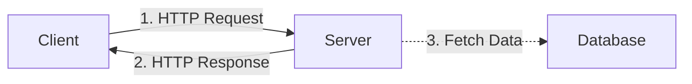

# Apps and Architectures

An **Application** (or App) is a software program designed to perform a specific task for a user. Whether it's a browser like Firefox, a social platform like Instagram, or a tool like VS Code, every app follows fundamental structural patterns. Understanding these patterns is the first step in Modern Application Development.

## The Three Core Layers of an Application
Most modern applications, regardless of their complexity, are composed of three distinct layers. Think of these as the foundation, the engine, and the paint job of a car.

1.  **Storage (Data Layer)**: Where the information lives. This could be a sophisticated SQL Database (like PostgreSQL), simple local text files, or cloud storage (like AWS S3).
2.  **Computation (Logic Layer)**: The "brain" of the application. This layer processes data, applies business rules, calculates totals, and manages security. 
3.  **Presentation (UI Layer)**: What the user actually sees and interacts with. This is built using HTML/CSS for web apps, or native components for mobile apps.

## Network Architectures

When applications need to communicate over the internet, they typically use one of two main architectural models:

### 1. Client-Server Model
In this model, a **Server** provides resources or services, and a **Client** (like your web browser or mobile app) requests them. This is the backbone of the modern web (e.g., Netflix, Amazon).



*   **Pros**: Centralized control, easy to update the server without touching the clients, secure data storage.
*   **Cons**: The server is a single point of failure. If the server crashes, all clients lose access.

### 2. Peer-to-Peer (P2P) Model
In P2P networks, there is no centralized server. Every "node" (computer) acts as *both* a client and a server. Examples include BitTorrent, Bitcoin, and early Skype.

*   **Pros**: Highly resilient to failure, naturally scales as more users join the network.
*   **Cons**: Harder to control, update, and secure.

## Software Architecture Patterns

When writing the code for an application, developers use **Design Patterns** to keep the code organized.

### Separation of Concerns (SoC)
SoC is a fundamental design principle. It states that a computer program should be separated into distinct sections, such that each section addresses a separate concern. 
For example, the code that calculates a user's shopping cart total should *not* be the same code that styles the "Checkout" button.

### The MVC Pattern
The **Model-View-Controller** pattern is the most influential architecture in web development. It strictly applies the Separation of Concerns.

-   **Model**: Manages data and business logic. It talks to the database.
-   **View**: Handles the visual layout and display. It talks to the user.
-   **Controller**: The traffic cop. It routes user requests from the View, updates the Model, and then updates the View again.

[TIP]
**Why use MVC?** If you want to change your app's design (View), you don't have to touch your database logic (Model). This makes teamwork and maintenance much easier!
[/CALLOUT]

## Simple Architecture Example (Python)

Here is a 10-line Python example demonstrating the concept of separating Logic from Presentation:

```python
# 1. STORAGE / MODEL (The Data)
user_database = {"alice": "password123", "bob": "qwerty"}

# 2. COMPUTATION / CONTROLLER (The Logic)
def login_user(username, password):
    if username in user_database and user_database[username] == password:
        return True
    return False

# 3. PRESENTATION / VIEW (The UI)
def display_login_screen():
    print("=== Welcome to the App ===")
    user = input("Username: ")
    pwd = input("Password: ")
    
    if login_user(user, pwd):
        print("Success! You are logged in.")
    else:
        print("Error: Invalid credentials.")

# Run the app
display_login_screen()
```

## Glossary
- **SDK**: Software Development Kit — a set of tools provided by a platform to help you build apps for it.
- **Node**: Any computing device connected to a computer network.
- **Latency**: The time delay between sending a request and receiving the response.
