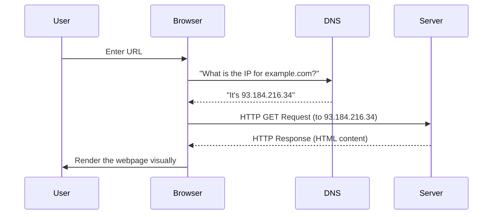

# Web Fundamentals

The web is a complex system of protocols and standards that allow information to be shared globally. To understand the modern web, we must look at its foundational layers: **TCP/IP** and **HTTP**.

## History & Protocols
The Internet evolved from **Circuit Switching** (a physical connection like old telephone lines) to **Packet Switching** (dividing data into small chunks that can take different paths and reassemble at the destination).

### TCP/IP Stack (1983)
-   **IP (Internet Protocol)**: Handles addressing and routing packets across the network. Like writing an address on an envelope.
-   **TCP (Transmission Control Protocol)**: Ensures reliable delivery. It handles retries, ordering, and error control. Like registered mail with return receipts.

### TCP vs UDP

| Feature | TCP | UDP |
| :--- | :--- | :--- |
| **Reliability** | Guaranteed delivery | Best effort (no retries) |
| **Connection** | Connection-oriented | Connectionless |
| **Speed** | Slower (overhead) | Faster (minimal overhead) |
| **Use Cases** | Web, Email, SSH | Video streaming, Gaming, DNS |

## How the Web Works

When you enter a URL like `http://example.com` in your browser, a rapid sequence of events occurs:



## HTTP: The Language of the Web
**HTTP** (HyperText Transfer Protocol) is a text-based, **stateless** protocol. This means the server does not remember previous requests from the same client.

### HTTP Methods (Verbs)
When sending a request, the client specifies an action using an HTTP Method:
-   **GET**: Retrieve data (e.g., loading a webpage). Safe and repeatable.
-   **POST**: Submit data to the server (e.g., submitting a login form). Changes server state.
-   **PUT**: Replace data entirely.
-   **DELETE**: Remove data.

### Common Status Codes
-   **200 OK**: Request succeeded. Everything is fine.
-   **301 Moved Permanently**: URL has changed. Browser automatically redirects.
-   **400 Bad Request**: The client sent invalid data.
-   **404 Not Found**: Resource does not exist on the server.
-   **500 Internal Server Error**: The server's code crashed.

[WARNING]
Statelessness is a constraint, not a bug. It allows the web to scale massively because servers don't need to keep track of millions of open sessions. To "simulate" state for things like shopping carts, we use **Cookies** and **Sessions**.
[/CALLOUT]

## Making an HTTP Request with Python
Here is a 5-line example of how you can act like a browser using Python's `requests` library:

```python
import requests

# Send an HTTP GET request to a URL
response = requests.get('https://api.github.com')

# Check the status code and print the result
if response.status_code == 200:
    print("Success! Data received.")
    print(response.json()) # Parse the JSON response
else:
    print(f"Error! Server returned: {response.status_code}")
```

## Glossary
- **DNS**: Domain Name System — the "phonebook" of the internet.
- **Port**: A virtual endpoint for communication (e.g., HTTP = 80, HTTPS = 443).
- **RTT**: Round-Trip Time — time taken for a packet to go to a destination and back.
