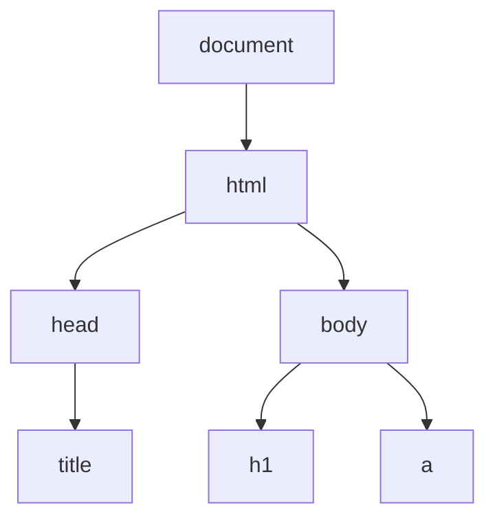

# HTML and the DOM

**HTML** (HyperText Markup Language) is the standard markup language for documents designed to be displayed in a web browser. It defines the structure and semantics of your content.

## Document Structure
Every HTML document follows a tree-like structure starting with a root `<html>` element.

### Core Tags
-   **Metadata**: `<head>`, `<title>`, `<meta>`, `<link>`, `<script>`.
-   **Sectioning**: `<header>`, `<nav>`, `<main>`, `<footer>`, `<section>`, `<article>`.
-   **Grouping**: `
` (generic), `` (inline), `
` (paragraph).
-   **Text Level**: `<a>` (link), `<strong>` (bold emphasis), `<em>` (italic emphasis), `` (image).

[NOTE]
**Semantic HTML**: Use tags that describe their meaning, not just their look. For example, use `<nav>` for navigation links instead of a generic `
`. This is crucial for **Accessibility** and **SEO**.
[/CALLOUT]

## The Document Object Model (DOM)
The **DOM** is a programming interface for web documents. It represents the page so that programs (like JavaScript) can change the document structure, style, and content.

### DOM Reflow
A **Reflow** is the process by which the browser calculates the positions and geometries of all the elements in the DOM.
-   **Triggered by**: Adding/removing elements, changing styles (width, height), or window resizing.
-   **Performance**: Reflows are computationally expensive. Efficient apps try to minimize them.

[TIP]
Modern frameworks like **React** use a "Virtual DOM" to minimize expensive reflows by calculating changes in memory before applying them to the real DOM.
[/CALLOUT]

## Glossary
- **Anchor**: The `<a>` tag used for hyperlinks.
- **Attribute**: Additional information provided inside a tag (e.g., `href`, `src`, `id`).
- **Entity**: Special character codes (e.g., `&copy;` for ©).
