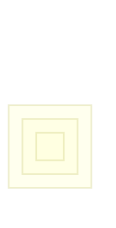

# CSS Design System

**CSS** (Cascading Style Sheets) is used to style and lay out web pages — for example, to alter the font, color, size, and spacing of your content, split it into multiple columns, or add animations and other decorative features.

## The Cascade & Precedence
When multiple styles are applied to an element, the browser follows a hierarchy to decide which one "wins":
1.  **Inline CSS** (`style` attribute): Highest priority.
2.  **Internal CSS** (`<style>` block in head).
3.  **External CSS** (`.css` file via `<link>`): Lowest priority.

[NOTE]
If two rules have the same priority, the one defined **later** in the stylesheet takes precedence. This is the "Cascading" part of CSS.
[/CALLOUT]

## Selectors
Selectors tell the browser which elements to apply styles to.
-   **Tag**: `h1 { ... }`
-   **Class**: `.primary-btn { ... }`
-   **ID**: `#main-header { ... }`
-   **Pseudo-class**: `a:hover { ... }` (state-based)
-   **Pseudo-element**: `p::first-letter { ... }` (structural part)

## The Box Model
Every element in CSS is a rectangular box. The box model consists of:
-   **Content**: The actual text or image.
-   **Padding**: Space between the content and the border.
-   **Border**: The edge of the box.
-   **Margin**: Space outside the border.

[TIP]
Use `box-sizing: border-box;` on all elements to make width and height include padding and borders, making layouts much more predictable.
[/CALLOUT]

## Modern Layouts
-   **Flexbox**: Ideal for 1D layouts (rows or columns).
-   **Grid**: Ideal for 2D layouts (rows AND columns).
-   **Responsive Design**: Using **Media Queries** (`@media`) to change styles based on screen size.

## Glossary
- **Responsive**: A design that adapts to different screen sizes.
- **Pseudo-class**: A keyword added to a selector that specifies a special state of the selected elements.
- **Hex Code**: A way to represent colors using hexadecimal values (e.g., `#ffffff`).
