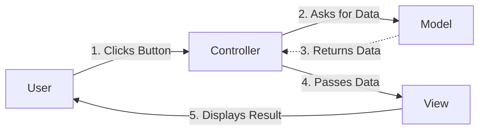

# MVC Architecture

**Model-View-Controller** (MVC) is a software design pattern commonly used for developing user interfaces. It divides the related program logic into three interconnected elements. 

Think of a restaurant:
*   **The Model** is the kitchen and the pantry. It knows what ingredients exist and how to make the food.
*   **The View** is the presentation of the food on the plate and the design of the dining room. It's what the customer sees.
*   **The Controller** is the waiter. The waiter takes your order (input), gives it to the kitchen (Model), takes the finished food, and brings it back to your table (View).

## The Components

### 1. Model (The Data Layer)
The **Model** corresponds to all the data-related logic. It represents the "truth" of the application. 
-   **Responsibilities**: Reading from the database, writing to the database, ensuring data is valid (e.g., an email address has an "@" sign).
-   **Example**: A `Student` class that connects to a database to fetch grades.

### 2. View (The Presentation Layer)
The **View** component is used for all the UI logic. It generates the final interface for the user based *strictly* on the data provided by the Model.
-   **Responsibilities**: Layout, HTML generation, CSS styling, UI/UX.
-   **Example**: An HTML template that displays the `Student`'s grades in a table.

### 3. Controller (The Brains / Router)
**Controllers** act as the interface between Model and View. They process incoming HTTP requests from the browser, tell the Model to do something, and then decide which View to show the user.
-   **Responsibilities**: Routing (deciding what URL does what), processing form data, connecting M and V.

## The MVC Flow



[WARNING]
**Strict Separation**: The Controller should never talk to the database directly. It must ask the Model to do it. Similarly, the View should never modify the data; it only displays what the Controller gives it. This separation prevents "spaghetti code."
[/CALLOUT]

## Python Code Example: A Tiny MVC App

Here is a 15-line example showing how these three components work together in code:

```python
# --- MODEL ---
class DatabaseModel:
    def get_user_name(self, user_id):
        # Pretend we look up a database here
        db = {1: "Alice", 2: "Bob"}
        return db.get(user_id, "Unknown User")

# --- VIEW ---
class HTMLView:
    def render_profile(self, name):
        return f"<h1>User Profile</h1><p>Welcome, {name}!</p>"

# --- CONTROLLER ---
class AppController:
    def handle_profile_request(self, user_id):
        model = DatabaseModel()
        view = HTMLView()
        
        # Controller gets data from Model
        name = model.get_user_name(user_id)
        
        # Controller passes data to View
        html_output = view.render_profile(name)
        return html_output

# Run the app
controller = AppController()
print(controller.handle_profile_request(1)) 
# Output: <h1>User Profile</h1><p>Welcome, Alice!</p>
```

## CRUD: The Data Lifecycle
Whether you are building Twitter or a Gradebook, you are usually performing four basic functions on data, known as **CRUD**:
1.  **Create**: Adding new entries (e.g., signing up).
2.  **Read**: Retrieving lists or details (e.g., viewing a profile).
3.  **Update**: Modifying existing data (e.g., changing a password).
4.  **Delete**: Removing data (e.g., deleting a post).

## Glossary
- **Business Logic**: The custom rules or algorithms that handle the exchange of information between a database and user interface.
- **Spaghetti Code**: Code that is complex and tangled, usually because it lacks a proper architecture like MVC.
- **Pattern**: A repeatable solution to a common problem in software design.
