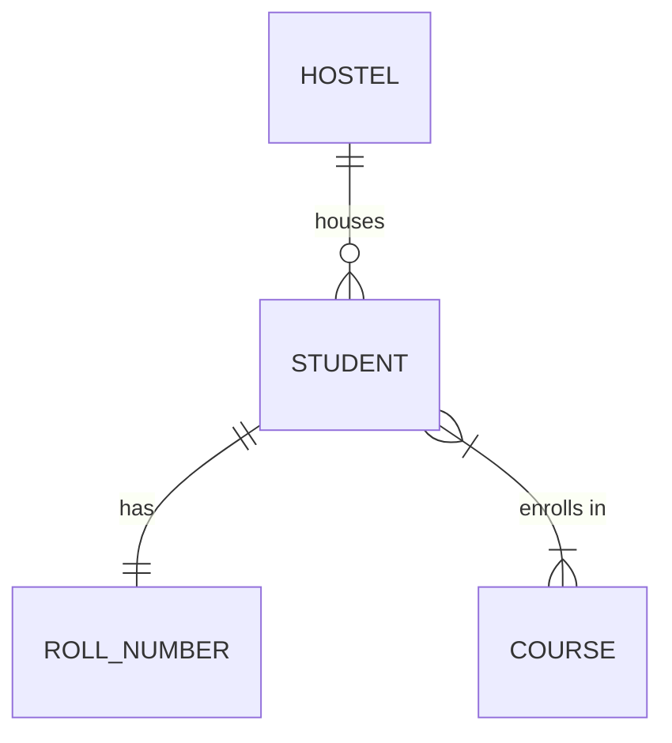

# Persistent Storage

Data stored in variables (in-memory) is lost as soon as the program stops. To keep data permanently, we must store it on a non-volatile medium like a Hard Drive (HDD) or Solid State Drive (SSD).

## Data Representation in Python
Before saving data to disk, we often model it using Classes and Objects.

[NOTE]
**Running Example: Student Object**
Using a class variable for auto-incrementing IDs ensures every student gets a unique identifier.
[/CALLOUT]

## Serialization Options
**Serialization** is the process of converting an object into a format that can be stored or transmitted.

### 1. Flat Files (CSV/TSV)
Comma-Separated Values (CSV) are simple text files where each line is a record and fields are separated by commas.
-   **Pros**: Human-readable, compatible with spreadsheets.
-   **Cons**: No data types, no relationships, slow for large datasets.

### 2. Pickling
Python's `pickle` module can serialize entire Python objects into binary files.
-   **Pros**: Easy to use, preserves complex Python types.
-   **Cons**: Python-specific, security risks (unpickling untrusted data can execute malicious code).

## Databases
For complex applications, we use **Databases**.
-   **Relational (SQL)**: Data is stored in tables with fixed schemas. Excellent for consistency.
-   **NoSQL**: Unstructured or semi-structured data (JSON-like). Excellent for flexibility and scale.

### Relationships
-   **One-to-One**: One student has one roll number.
-   **One-to-Many**: One hostel has many students.
-   **Many-to-Many**: Many students take many courses.

## Glossary
- **Persistence**: The characteristic of state that outlives the process that created it.
- **Primary Key**: A unique identifier for a record in a database.
- **Schema**: The formal structure of a database.
