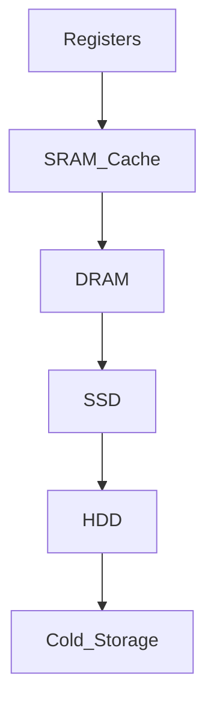

# Backend Systems

Modern backends are built on a deep hierarchy of storage and computation layers. Understanding this hierarchy is crucial for optimizing application performance.

## Memory Hierarchy
Computer systems use different types of storage, balancing cost, capacity, and speed.

### Storage Parameters

| Layer | Latency | Throughput | Density | Cost |
| :--- | :--- | :--- | :--- | :--- |
| **Registers** | < 1ns | Highest | Lowest | Highest |
| **DRAM (RAM)** | ~100ns | High | Low | High |
| **SSD (Flash)** | ~100us | Medium | Medium | Medium |
| **HDD (Disk)** | ~10ms | Low | High | Low |
| **Cold Storage** | Hours/Days | Lowest | Highest | Lowest |

[NOTE]
**Cold Storage**: Services like Amazon Glacier or Google Archive Storage provide extremely low-cost storage for data that is rarely accessed. The tradeoff is **Latency** — it can take hours to retrieve data from cold storage.
[/CALLOUT]

## Query Optimization
To make backends fast, we must optimize how we query data.
1.  **Indexing**: Creating sorted versions of columns (B-Trees or Hash Indexes) to enable logarithmic search ($O(\log N)$) instead of linear search ($O(N)$).
2.  **Caching**: Storing frequently accessed data in faster layers (like RAM/Redis) to avoid hitting the disk or slow network.

[TIP]
**Big-O Notation**: Always consider the scalability of your algorithms. An $O(N^2)$ algorithm might work for 100 students but will crash your server with 100,000 students.
[/CALLOUT]

## Glossary
- **Latency**: The time it takes for a single request to be fulfilled.
- **Throughput**: The amount of data processed per unit of time.
- **B-Tree**: A self-balancing tree data structure that maintains sorted data and allows for fast searches, insertions, and deletions.
