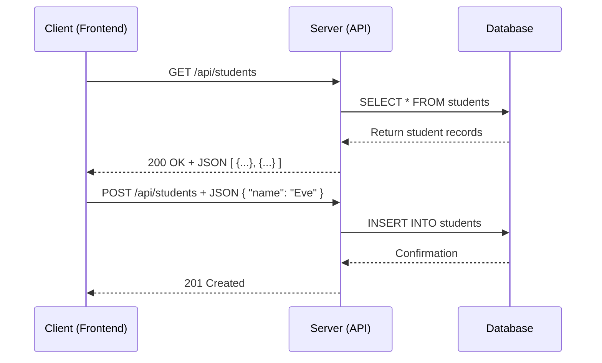

# API Design and REST

An **API** (Application Programming Interface) is a set of rules that allows different software entities to communicate with each other. In web development, we primarily use **RESTful APIs** over HTTP.

## REST Constraints
**REST** (Representational State Transfer) is an architectural style with six constraints:
1.  **Client-Server**: Separation of concerns.
2.  **Stateless**: Each request must contain all info needed to process it.
3.  **Cacheable**: Responses must define themselves as cacheable or not.
4.  **Uniform Interface**: Resources are identified by URIs.
5.  **Layered System**: Clients cannot tell if they are connected directly to the end server or an intermediate.
6.  **Code on Demand** (Optional): Servers can temporarily extend client functionality by transferring executable code (e.g., JS).

## HTTP Verbs in REST
REST uses standard HTTP methods to perform actions on resources:
-   **GET**: Retrieve a resource (Read).
-   **POST**: Create a new resource (Create).
-   **PUT**: Update an existing resource (Update).
-   **DELETE**: Remove a resource (Delete).

[NOTE]
**Idempotency**: An operation is idempotent if performing it multiple times has the same effect as performing it once. `GET`, `PUT`, and `DELETE` are idempotent. `POST` is NOT.
[/CALLOUT]

## Data Formats
Modern APIs primarily use **JSON** (JavaScript Object Notation) for data exchange because it is lightweight and easy for machines to parse.

## OpenAPI Specification (OAS)
The OAS is a standard for describing REST APIs. It allows humans and computers to discover and understand the capabilities of a service without access to source code.

[TIP]
Always follow a **Design-First** approach. Define your API using OpenAPI/Swagger before writing any code. This ensures a consistent contract between frontend and backend teams.
[/CALLOUT]

## Glossary
- **Resource**: Any piece of information that can be named (e.g., a student, a course).
- **URI**: Uniform Resource Identifier — the address used to access a resource.
- **Serialization**: Converting a data structure (like a Python dict) into a format like JSON.
