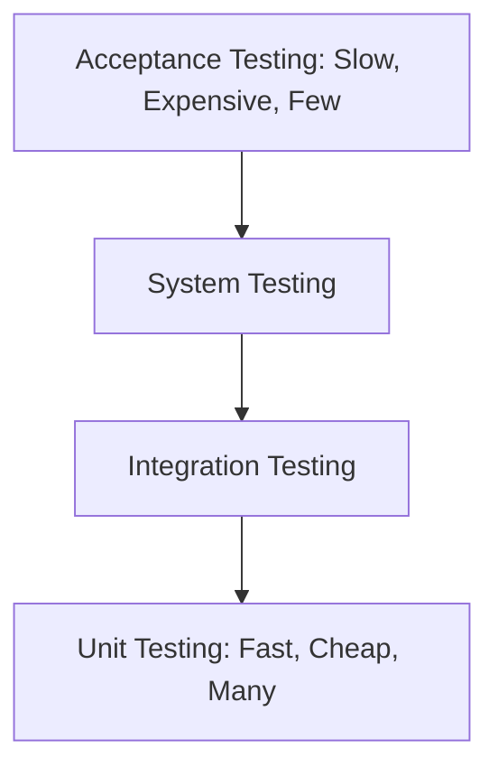

# Software Testing

Testing is the process of evaluating a system to verify that it satisfies specified requirements and to identify defects.

## Levels of Testing
1.  **Unit Testing**: Testing individual components in isolation.
2.  **Integration Testing**: Testing how different modules work together.
3.  **System Testing**: Testing the entire application in a production-like environment.
4.  **Acceptance Testing**: Final check by the user or client to ensure requirements are met.

## Testing Methodologies
-   **Black-Box Testing**: Testing without knowledge of the internal code. Focuses on inputs and outputs.
-   **White-Box Testing**: Testing with full access to the source code. Focuses on code paths and logic.
-   **Regression Testing**: Re-running tests after a code change to ensure nothing else broke.

[NOTE]
**Coverage**: Code coverage measures the percentage of your code that is executed by tests. While high coverage is good, **100% coverage does not mean 0% bugs**.
[/CALLOUT]

## Testing with pytest
**pytest** is a popular Python testing framework that makes it easy to write small, readable tests.
-   **Fixtures**: Functions that run before each test to set up state (e.g., creating a temporary database).
-   **Parametrization**: Running the same test logic with different inputs.

[TIP]
**Test-Driven Development (TDD)**: A workflow where you write the test *before* the actual code. This ensures your code is testable and focuses on the requirements.
[/CALLOUT]

## Glossary
- **Defect**: An error, flaw, or fault in a computer program or system.
- **Fixture**: A fixed environment used for testing a piece of software.
- **Regression**: A bug that appears after a previously working feature is modified.
